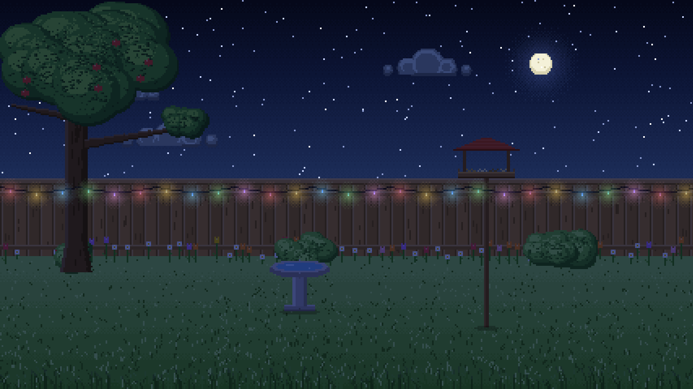
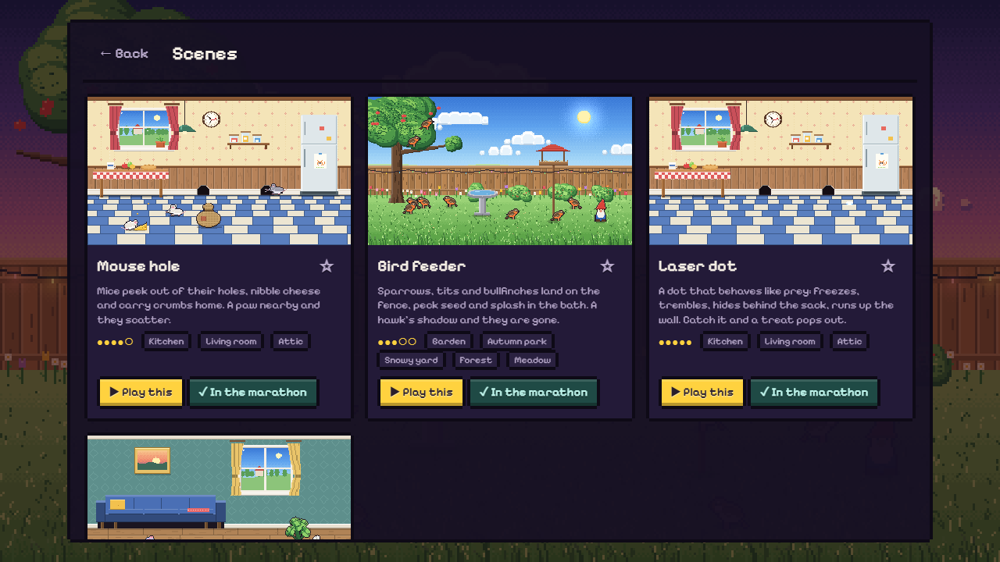

# Purrcade — кіт-TV

Піксельні ігри для справжніх котів. Вмикаєш на моніторі чи планшеті, і кіт годинами полює:
миші визирають з нір, птахи сідають на годівничку, лазерна точка ховається за мішок, клубок
розмотується по підлозі. Сцени й місця змінюються самі, жваві чергуються зі спокійними, щоб
коту не набридло, а людям було цікаво дивитися.

**▶ Грати: [purrcade.vercel.app](https://purrcade.vercel.app)**


| | |
|---|---|
|  |  |
|  |  |

## Що всередині

- **Сцени з різною логікою**, не одне й те саме, що мерехтить:
  - миші ховаються в нори, гризуть сир і тягнуть крихти додому;
  - зграйки птахів на годівничці клюють, купаються й сваряться, а тінь яструба лякає всіх разом;
  - лазерна точка рухається як здобич: завмирає, тремтить, лізе по стіні, ховається;
  - іграшки з фізикою: клубок, що лишає нитку, дзвіночок, фетрова мишка, м’ячик, що котиться сам;
  - і ще багато іншого (див. галерею в застосунку).
- **Локації**: кухня, вітальня, горище, сад, осінній парк, луг, ліс, зимове подвір’я та інші.
  Кожна має ранок, день, вечір і ніч, погоду (дощ, сніг, листя, пелюстки, пил у промені) і світло
  ламп, гірлянд та світних грибів уночі.
- **Марафон**: сцени й місця змінюються самі, жваві чергуються зі спокійними, улюблені частіше,
  час доби як надворі.
- **Лапа рахується**: влучив, і спалах, зірочки, смаколик; статистика по днях («сьогодні спіймано 12»).
- **Захист від кота**: меню відкривається лише утриманням правого верхнього кута 2 секунди, Esc або
  кнопкою, що з’являється тільки під справжньою мишею.
- **Налаштування**: тривалість сцени, характер (спокійно ↔ шалено), кількість і швидкість звірят,
  розмір усього, «котячий зір» (синьо-жовта палітра), яскравість, звуки (писк, щебет; вимкнені, поки
  не ввімкнеш), таймер сеансу, не гасити екран, українська / English.
- Працює офлайн і ставиться як застосунок (PWA).

## Як це зроблено

Усе намальовано кодом, без жодного файлу-картинки: кожна тварина й іграшка рисується у маленький
буфер палітрових пікселів, отримує обведення й світло згори, а фони малюються раз на сцену
дизерингом і смугами, як у 16-бітних іграх. Світ має близько 270 пікселів у висоту й
збільшується в ціле число разів, тож кожен піксель квадратний на будь-якому екрані.

- TypeScript, Canvas 2D, Vite; жодних залежностей під час виконання, крім піксельного шрифту.
- Фіксований крок фізики (1/60 с), день і ніч множенням кольору, світло ламп додаванням.
- Звуки синтезуються WebAudio на льоту.

```bash
npm install
npm run dev        # http://localhost:5190
npm test
npm run build
```

Для розробки: `/?view=kitchen&scene=mice&tod=night` показує одну сцену, `/?sheet=bird&zoom=120`
показує всі кадри істоти.

---

*Pixel games for real cats. Put it on a monitor or a tablet and let the cat hunt for hours: mice
peek out of holes, birds come to the feeder, a laser dot hides behind the sack, a ball of yarn
unrolls across the floor. Scenes and places change by themselves, lively and calm in turn.*

Made with love for Jenny. MIT licence.
