# Purrcade — кіт-TV

Піксельні ігри для справжніх котів. Вмикаєш на моніторі чи планшеті, і кіт годинами полює:
миші визирають з нір, птахи прилітають на годівничку, лазерна точка ховається за мішок,
клубок розмотується по підлозі, кої пірнають під латаття. Сцени й місця змінюються самі,
жваві чергуються зі спокійними, щоб коту не набридло, а людям було цікаво дивитися.

**▶ Грати: [purrcade.vercel.app](https://purrcade.vercel.app)**

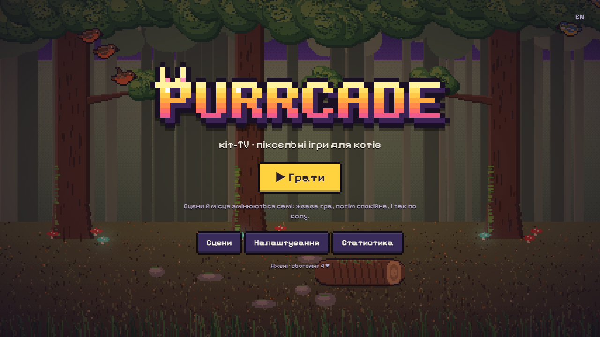

| | |
|---|---|
| 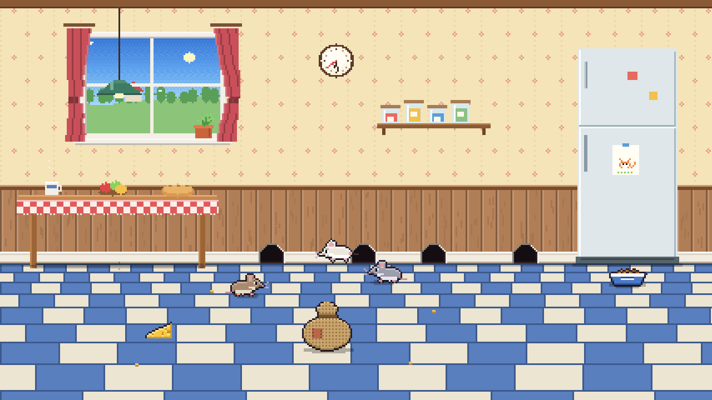 | 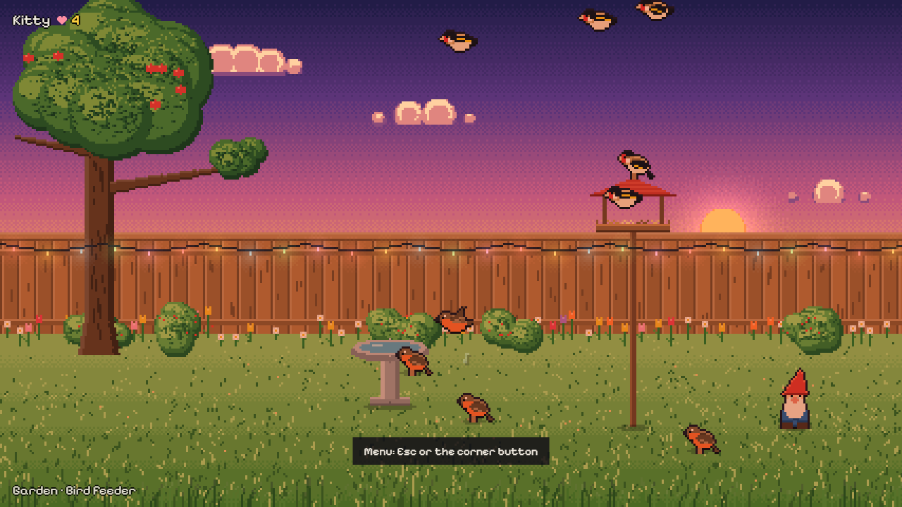 |
| 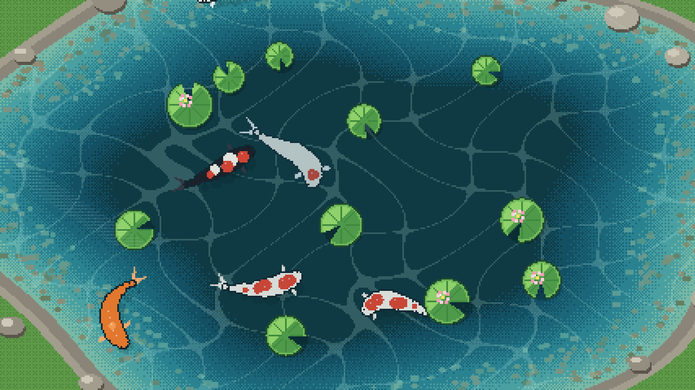 | 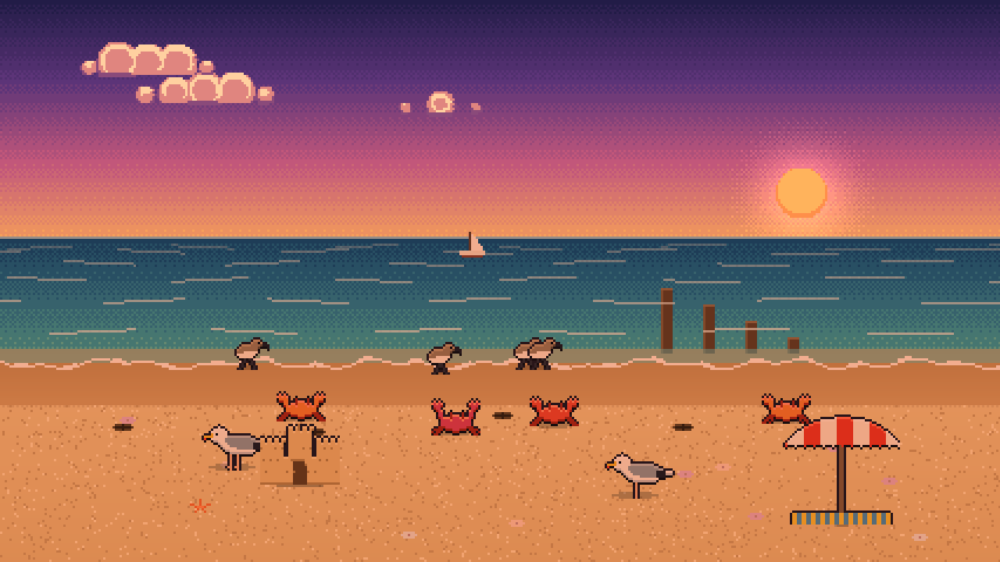 |
| 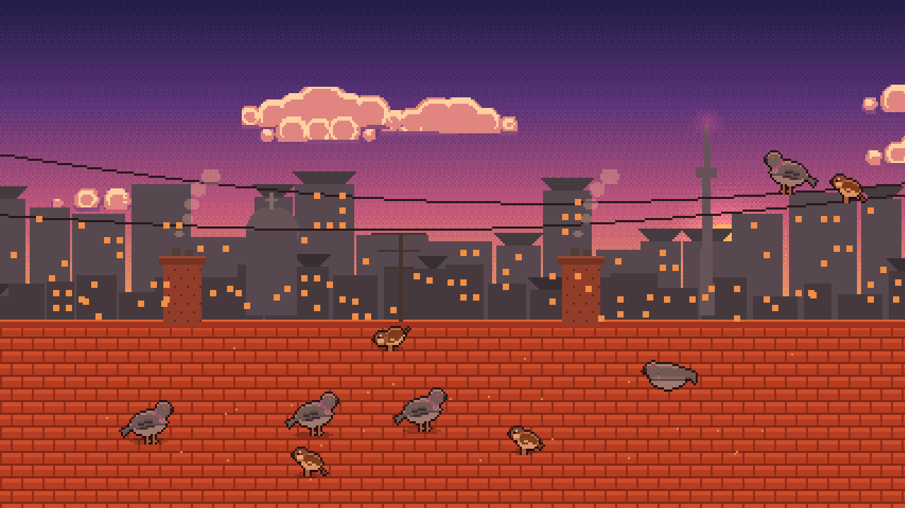 | 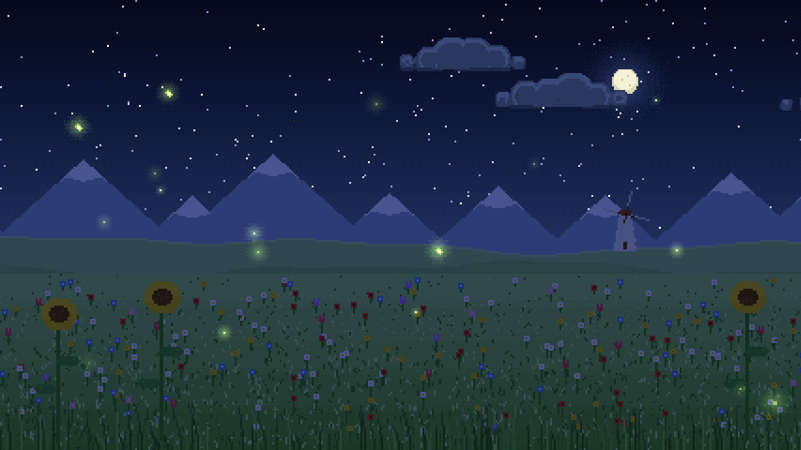 |
| 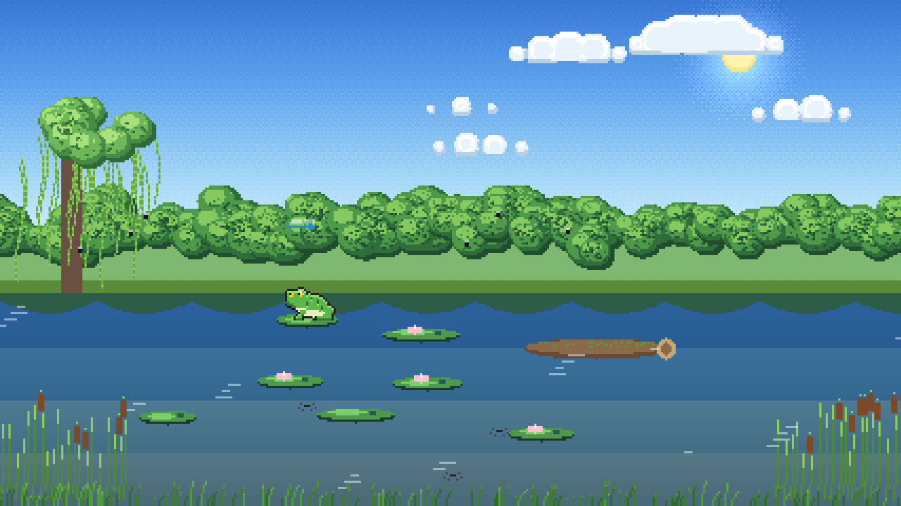 | 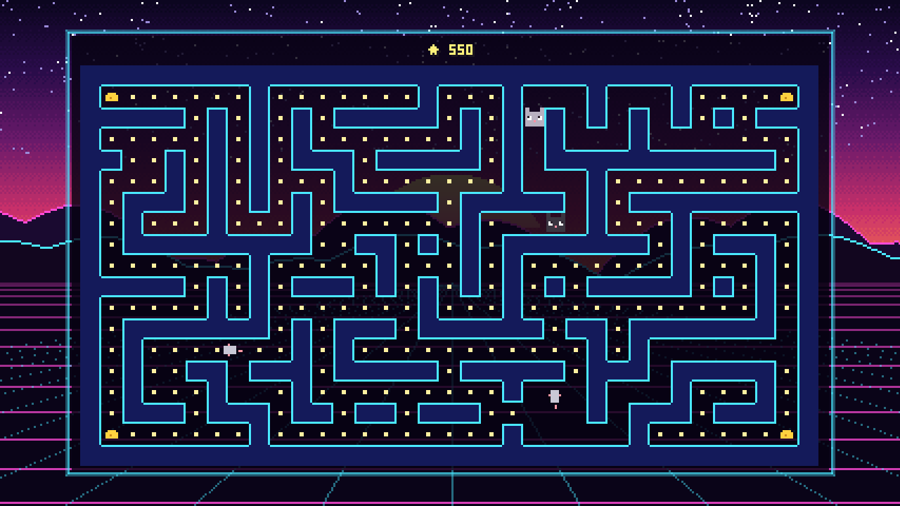 |
| 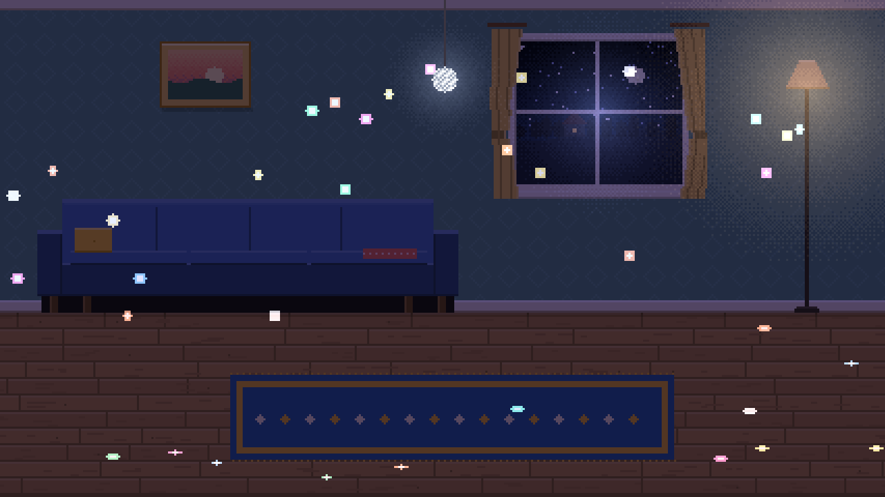 | 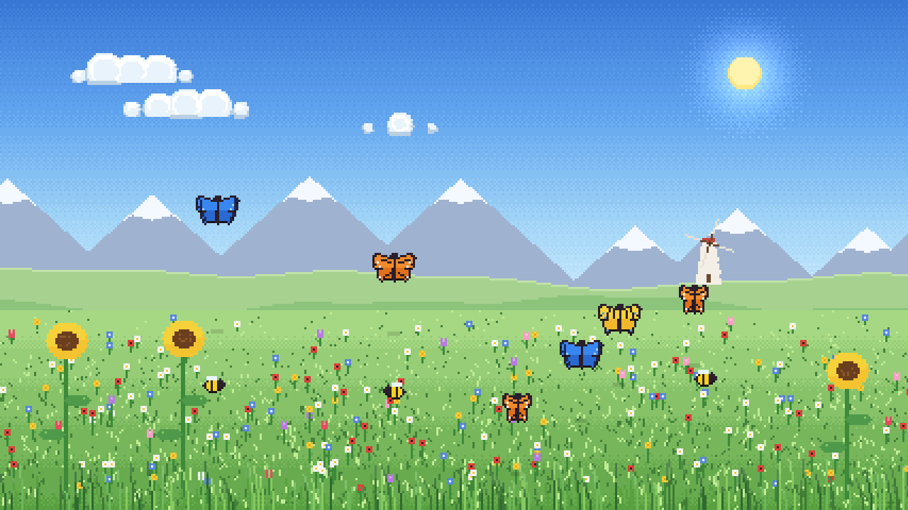 |

## 21 сцена, у кожної своя логіка

| Сцена | Що відбувається |
|---|---|
| Мишача нора | миші визирають, бігають уздовж стіни ривками, гризуть сир, тягнуть крихти в нору, ховаються за мішок; лапа поруч, і всі врозтіч |
| Пташина годівничка | зграйки горобців, синиць, снігурів, щиглів і голубів; клюють, купаються, сваряться; тінь яструба, і всі злітають |
| Лазерна точка | рухається як здобич: ривок, завмирання, тремтіння, по стіні, за меблі, в нору; спіймав, і вискакує смаколик |
| Вудочка з пір’ям | справжня мотузка з фізикою: пір’я літає, волочиться, ховається й смикається |
| Іграшки й клубок | клубок лишає нитку, дзвіночок стрибає, фетрова мишка ковзає, розумний м’ячик котиться сам |
| Робот-пилосос | пилосос збирає крихти, на ньому катається мишка; поруч заводна мишка з ключиком |
| Коропи кої | вид згори: риби гнуться, пірнають під латаття, збираються до корму, від дотику кола на воді |
| Акваріум | зграя неонів, риба-клоун, скалярія, півник, крабик; риба-їжак надувається від дотику |
| Морський берег | крабики бігають боком і пірнають у нірки, кулики бігають за хвилею, чайки ширяють |
| Жабка на лататті | ловить мух язиком, квакає, стрибає з листка на листок; бабки, водомірки, риба вистрибує |
| Білка на дубі | збирає жолуді, закопує, бігає по стовбуру, ховається за ним і визирає |
| Хто в норі? | кроти вискакують і дражняться, інколи кролик, зрідка золотий кріт |
| Мильні бульбашки | райдужні, погойдуються, відскакують і лопаються; іноді велетенська |
| Сонячні зайчики | удень зайчик від дзеркала й веселка від кришталика, вночі диско-куля |
| Метелики | шість видів метеликів і бджоли над квітами |
| Світлячки | нічне поле з хвилею світла, сова на гілці, їжачок у траві |
| Жучки в траві | сонечка, жук, мурахи з листочками, коник, гусінь, павук на павутинці |
| Мишачий лабіринт | Pac-Man навпаки: мишки тікають від котів, а після великого сиру коти тікають від мишок |
| Цеглинки | арканоїд, що грає сам; цеглинки викладені сердечком, котиком, рибкою |
| Змійка | неонова змійка сама шукає шлях до рибки й не кусає себе за хвіст |

**15 місць:** кухня, вітальня, горище, сад, осінній парк, луг, ліс, зимове подвір’я, ставок з кої,
ставок, акваріум, пляж, дахи міста, аркада. Ранок, день, вечір і ніч (за годинником), погода:
дощ, сніг, листя, пелюстки, пил у промені. Уночі світять лампи, гірлянди, вікна й світні гриби.

## Для кота і для людей

- **Марафон**: сцени й місця змінюються самі, після двох-трьох жвавих іде спокійна; улюблені
  частіше; одна й та сама не повторюється підряд.
- **Лапа рахується**: влучив, і спалах та зірочки; статистика по днях і видах здобичі.
- **Захист від кота**: меню відкривається лише утриманням правого верхнього кута 2 секунди, Esc
  або кнопкою, що з’являється тільки під справжньою мишею.
- **Налаштування**: тривалість сцени, характер (спокійно ↔ шалено), кількість і швидкість звірят,
  розмір усього, «котячий зір» (синьо-жовта палітра), яскравість, час доби, погода, звуки (писк,
  щебет, вода; вимкнені, поки не ввімкнеш), чутливість до лапи, таймер сеансу з екраном відпочинку,
  не гасити екран, українська / English.
- Працює офлайн і ставиться як застосунок (PWA).

Клавіші: `Esc`, `M` або пробіл відкривають меню, `N` або `→` дає наступну сцену, `F` вмикає весь екран.

## Як це зроблено

Усе намальовано кодом, без жодного файлу-картинки: кожна тварина й іграшка рисується у маленький
буфер палітрових пікселів, отримує обведення й світло згори, а фони малюються раз на сцену
дизерингом і смугами, як у 16-бітних іграх. Світ має 180–270 пікселів у висоту й збільшується в
ціле число разів, тож кожен піксель квадратний на будь-якому екрані.

- TypeScript, Canvas 2D, Vite; жодних залежностей під час виконання, крім піксельного шрифту.
- Фіксований крок (1/60 с). Ніч, вечір і ранок робить множення кольору, лампи додаються світлом;
  небо не тонується, щоб зорі лишались яскравими.
- Мотузка вудочки працює на Верле, кої це ланцюжки точок, птахи летять «стрибками», як в’юрки,
  миші в лабіринті шукають шлях пошуком у ширину.
- Звуки синтезуються WebAudio на льоту.

```bash
npm install
npm run dev          # http://localhost:5190
npm test             # режисер марафону, налаштування, статистика, лабіринт
npm run build
node tools/sweep.mjs # кожна сцена в кожному місці в кожну пору доби, з лапами, без помилок
node tools/soak.mjs  # марафон на прискоренні: пам’ять, кадри, помилки
```

Для розробки: `/?view=kitchen&scene=mice&tod=night` показує одну сцену,
`/?sheet=bird&zoom=120` показує всі кадри істоти.

---

*Pixel games for real cats: 21 scenes with their own behaviour — mice, birds, a laser dot, a
feather wand on a real rope, koi, an aquarium, crabs and sandpipers, a frog, a squirrel, moles,
bubbles, sun spots and a disco ball, fireflies, bugs, and three self-playing arcade games — in 15
places at four times of day, with a marathon that alternates lively and calm scenes, cat-proof
menus, stats and offline play.*

Зроблено з любові до Джені. MIT licence.
